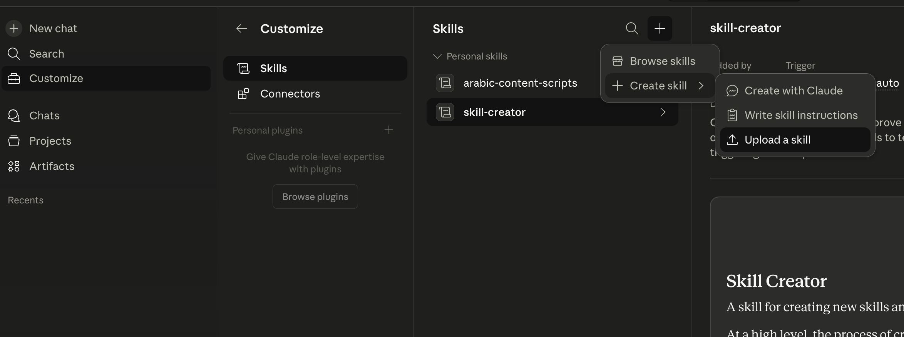
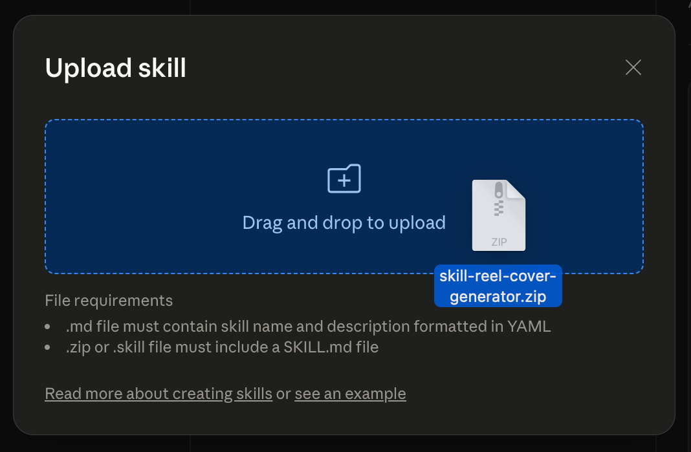

# Reel Cover Generator — Agent Skill

Generate professional, branded Instagram Reel cover images (9:16) from a video script. Designed for Arabic and English tech content creators.

**What it does:**
- Reads your reel script, detects its language, and summarizes it
- Suggests **3 title options** (in the script's language) — pick one or write your own
- Suggests **3 subtitle options** — pick one, write your own, or skip it
- Picks a matching visual theme (AI, cybersecurity, breaking news, etc.)
- Shows you the **final image prompt** for review — copy it into another tool, or let Claude continue
- If you continue with Claude: asks for your photo, then generates a cinematic 9:16 cover via Gemini

> **Note:** All conversation with you happens in **English**. Only the cover text (title/subtitle) follows the script's language.

## Installation

### Prerequisites

The image generation step requires a **Gemini API key**. Get one for free at [Google AI Studio](https://aistudio.google.com/app/apikey).

---

### Claude Code

#### Step 1 — Install the skill

**Option A — via `claude install-skill` (recommended):**

```bash
claude install-skill github.com/ismail9k/skill-reel-cover-generator
```

**Option B — via Skills CLI:**

```bash
npx skills add ismail9k/skill-reel-cover-generator
```

Verify it was installed:

```bash
npx skills list
```

#### Step 2 — Configure Gemini MCP

The skill uses [@houtini/gemini-mcp](https://github.com/houtini/gemini-mcp) to call Gemini's image generation API.

Add the following to `~/.claude/settings.json` (global) or `.mcp.json` (per-project):

```json
{
  "mcpServers": {
    "gemini": {
      "command": "npx",
      "args": ["-y", "@houtini/gemini-mcp"],
      "env": {
        "GEMINI_API_KEY": "your-gemini-api-key"
      }
    }
  }
}
```

Restart Claude Code after saving so it picks up the new MCP server.

---

### Claude Desktop

#### Step 1 — Configure Gemini MCP

1. Go to **Settings → Developer → Edit Config** to open `claude_desktop_config.json`
2. Add the `mcpServers` block:

```json
{
  "mcpServers": {
    "gemini": {
      "command": "npx",
      "args": ["-y", "@houtini/gemini-mcp"],
      "env": {
        "GEMINI_API_KEY": "your-gemini-api-key"
      }
    }
  }
}
```

3. Save the file and **restart Claude Desktop**

#### Step 2 — Install the skill

Claude Desktop doesn't support the Skills CLI, so install manually:

1. Download the skill zip from this repo (or clone it locally)
2. Go to **Customize → Skills → Create skill → Upload a skill**

   

3. Upload the zip file

   

## Usage

Once installed, trigger the skill by:

- Dropping a script and asking for a **"reel cover"**
- Or running `/reel-cover-generator`

**The skill will:**
1. Analyze your script — detect the language, summarize it, suggest a theme
2. Offer **3 title suggestions** — pick one or provide a custom title
3. Offer **3 subtitle suggestions** — pick one, provide a custom one, or skip it
4. Build the final image generation prompt and show it to you for review
5. Let you choose: **copy the prompt** to use elsewhere, or **continue with Claude**
6. If continuing: ask for your photo, generate the cover via Gemini, and offer refinements

**Language handling:** The skill talks to you in English. The cover text itself follows the script's language — Arabic scripts get Egyptian-dialect Arabic titles, English scripts get punchy English titles.

## Visual Themes

| Theme | When to use | Visual style |
|-------|-------------|--------------|
| `ai-futuristic` | AI tools, LLMs, future tech | Dark background, glowing neon blue/purple circuits |
| `cybersecurity` | Hacking, data leaks, privacy | Dark red/black, broken shields, code overlays |
| `breaking-news` | Announcements, releases, shocking facts | Bold typography, red accent, high contrast |
| `vs-comparison` | Tool comparisons, A vs B content | Split screen feel, dual tones, versus typography |
| `educational` | Explainers, how-it-works, tutorials | Clean, modern, bright with tech diagrams |
| `opinion-hot-take` | Opinions, controversial takes | Flame/spark aesthetics, bold text, energetic |
| `weekly-recap` | Weekly AI/tech roundups | Magazine-style layout, multiple visual elements |

## Customization

The skill is fully editable. Open `SKILL.md` to:

- Change the watermark handle (default: `@ismail9k`)
- Add new themes to the theme reference table
- Adjust the image generation prompt template
- Modify the quality checklist

## License

MIT
